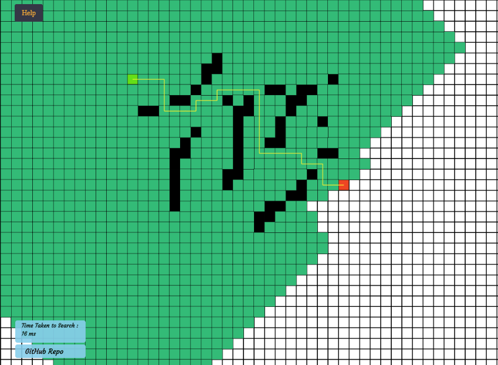

# mars-rover-navigator
This is a project aimed at implementing different path finding algorithms between two points. Any number of <b>walls</b> may be added and path may can be found between these two points. Also, <b>passable walls</b> may also be added, with an increased cost to cross them.  
<b>Bidirectional search</b>, search <b>without diagonal neighbours</b> and search with <b>4 different heuristics (for informed search)</b> are supported.
The <b>total time</b> taken for the search is also displayed at the end of every search.
The different algorithms supported -
### A* Search

     

### IDA* Search

  The Iterative Deepening Search works with the help of <b>heuristics</b>. A threshold of path length is set for every iteration and all nodes from the start position with maximum path length as threshold are explored. If endPos is not found within that threshold, the threshold is increased to the minimum path length required from the previous iteration. Thus, the search continues, increasing the threshold each time all nodes for a given threshold are explored until endPos is reached. 
As this algorithm may visit the same node via different paths, it may be possible that the time taken for the search explodes. Here, the search stops when the prescribed <b>time limit</b> for search is crossed.

  If the <b>visualise recursion</b> option is chosen, nodes are colored according to the order in which they are visited. Moreover, if a node is currently on different paths, it is colored  proportionately with a darker shade. As the node is removed from the recursive stack, it is uncolored to white. This helps us visualise the recursion, depicting the nodes visited and unvistited, in that particular order. In case the time limit is exceeded, only the recursive visulisation is seen, if the option is selected.

 IDA* search-- using Chebyshev Heuristics, allowing and not allowing diagonal neighbours, respectively-

     

### Breadth First Search
     

### Best First Search
     

### Djikstra Search
     
